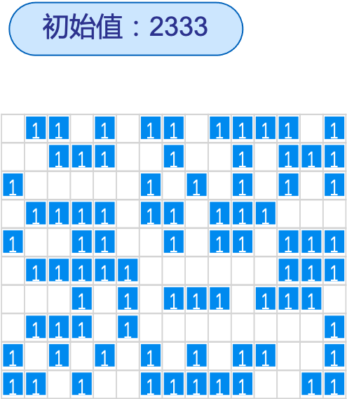

# Introduction

本项目使用python分别实现了遗传算法（GA）和模拟退火算法（SA）用来解决TSP问题和背包问题两种实际场景，寻求两者差异并调优。TSP问题的GA算法见TSP/GA_TSP.py，模拟退火算法见TSP/SA_TSP.py，背包问题的GA算法见BAG/GA_Bag.py，模拟退火算法见Bag/SA_bag.py。

- **TSP问题**

> #### 问题描述
>
> 现有一些节点，节点和节点之间均可相连形成边，节点之间的边存在距离，需要找到一个遍历方案先后访问所有的点，使的遍历的总距离最短。

- **0-1背包问题**

> #### 问题描述
>
> 已知 l 个物品的质量及其价值分别为Wi(i=1,2,3…)和Vi(i=1,2,3…)，背包的最大载重量为C。
> 则0-1背包问题可被描述为：选择哪些物品放入背包，使得背包在最大载重量限制之内所装物品的总价值最大？

## Environment

针对TSP问题，使用python复现遗传算法(GA)和退火算法(SA)，寻求两者差异并调优。

- python 3.6

## Structure

```
├── README.md 
├── TSP
	├── GA_TSP.py
	├── SA_TSP.py
├── BAG
	├── GA_Bag.py
	├── SA_Bag.py
├── TSP.py
├── Bag.py

```

文件功能描述：

|   文件    |                 描述                 |
| :-------: | :----------------------------------: |
| GA_TSP.py |      TSP问题的遗传算法(GA)实现       |
| SA_TSP.py |    TSP问题的模拟退火算法(SA)实现     |
|  TSP.py   | TSP问题场景主程序、数据和可视化分析  |
| GA_Bag.py |      背包问题的遗传算法(GA)实现      |
| SA_Bag.py |    背包问题的模拟退火算法(SA)实现    |
|  Bag.py   | 背包问题场景主程序、数据和可视化分析 |


# Algorithms

- 遗传算法(GA)

  

- 模拟退火算法(SA)

  

# Tips

1. 遗传算法核心要素：父代集合的数量，选择两个父代个体的方式，交叉操作、变异操作
2. 模拟退火算法核心要素：跳出最优解的概率必须是会随着时间变化，降温速度，初始温度，最终温度，随机解的生成方式，随季解数量

# Results&Analysis

1. TSP问题

   初始


​		TSP结果


​		TSP GA优化过程


​		TSP SA优化过程


2. 背包问题

   初始

   

   结果

   

   背包GA优化过程

   

   背包SA优化过程

   

# TODO

实现其他智能算法并应用在实际问题中

# Refrence

[Python实现遗传算法解决TSP问题](https://blog.csdn.net/weixin_43385826/article/details/118277411)

[【建模算法】基于遗传算法求解TSP问题（Python实现）](https://blog.csdn.net/baidu/article/details/124432689)

# Repositories

https://github.com/zhaoshuiruoli/AIAIgorithms_Orz